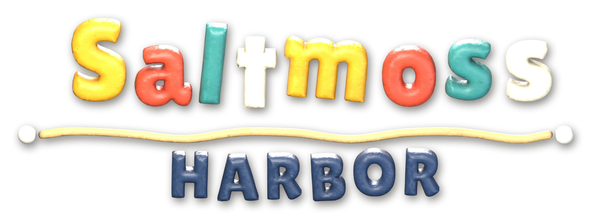
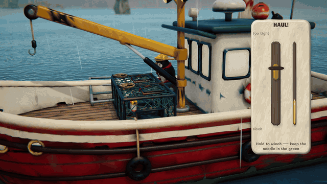
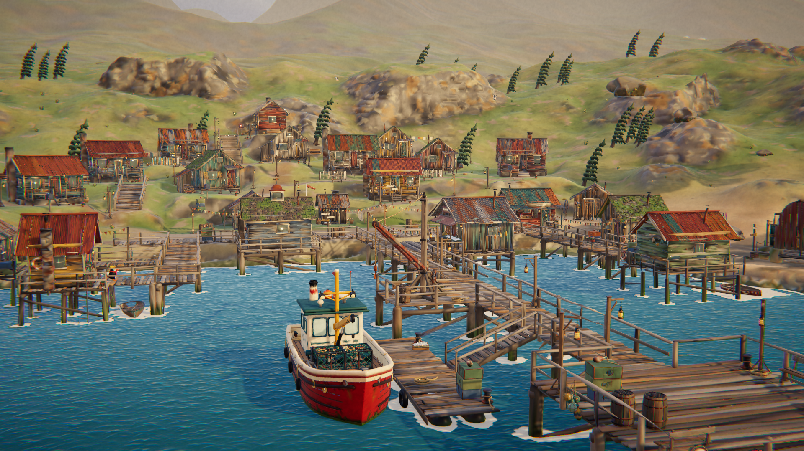
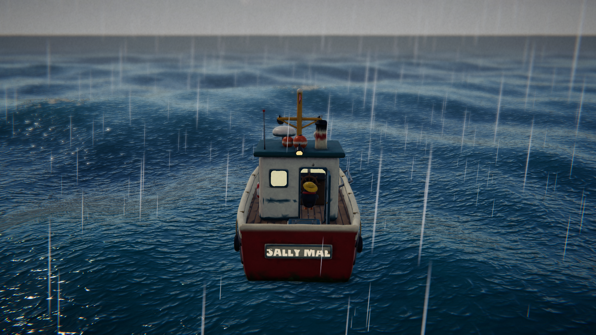
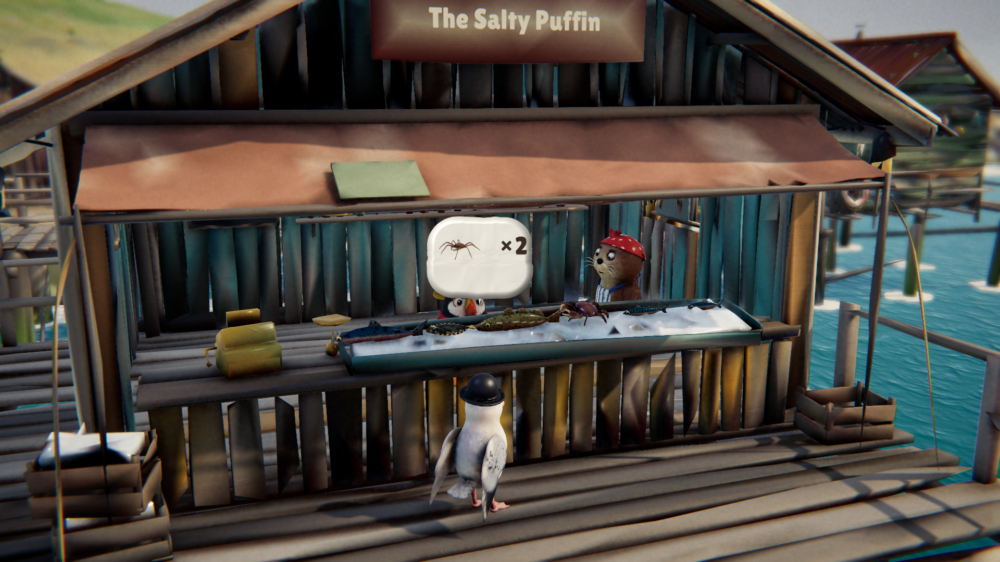
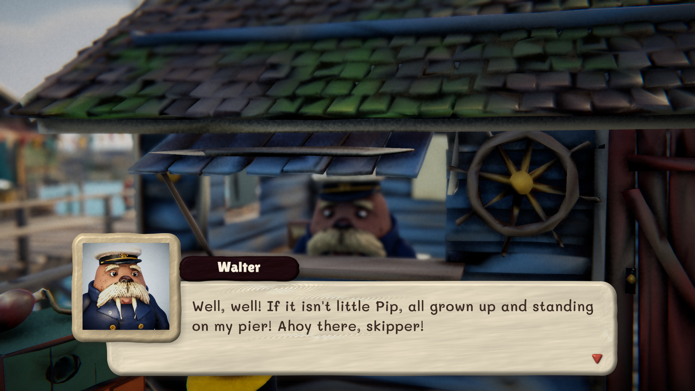
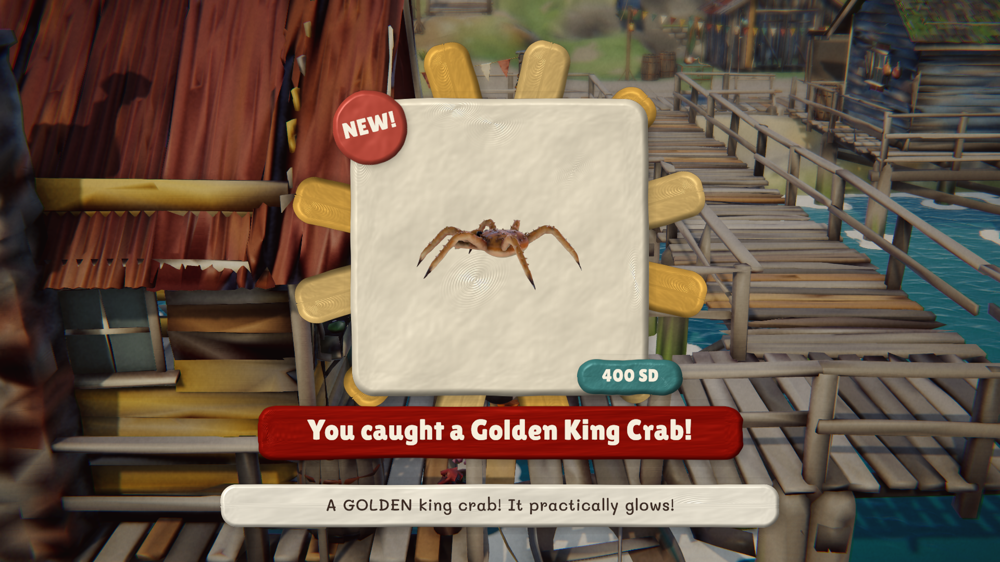
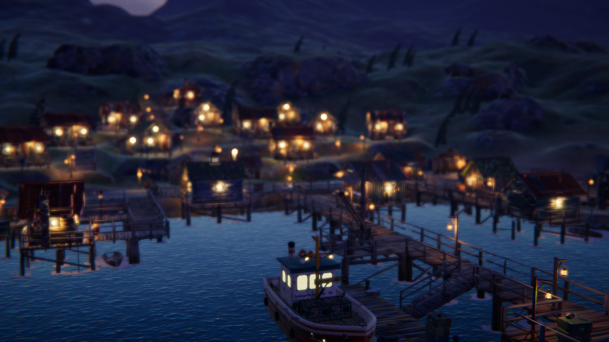
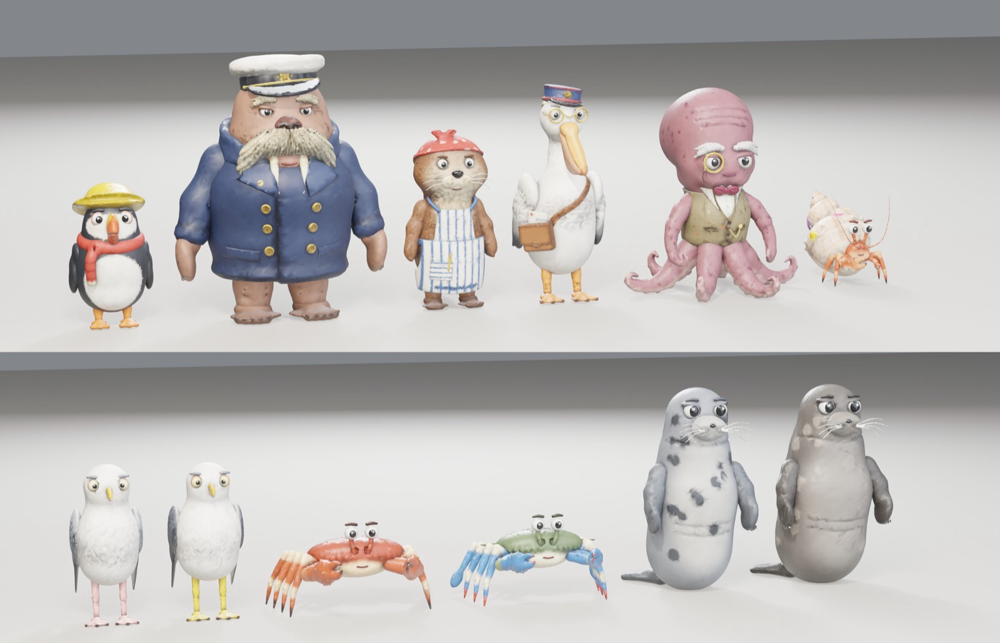

<p align="center"></p>

<p align="center"><b>A cosy claymation fishing tale on the cold Grey Sea.</b><br>
Haul crab pots through the swell, cast for fish shadows, dredge the deep for treasure, and bring a sleepy, sea-worn harbour back to life — all in hand-pressed plasticine, animated on twos.</p>

<p align="center">
<a href="../../releases/latest"><b>⬇ Download for macOS · Windows · Linux</b></a> ·
<a href="#easy-installers"><b>Easy installers</b></a> ·
<a href="#give-this-to-your-agent"><b>Install with your agent</b></a> ·
<a href="https://github.com/gazhenko/saltmoss-harbor/releases/download/v1.1.0/Saltmoss-Harbor-trailer.mp4"><b>▶ Watch the trailer</b></a>
</p>

<p align="center"><a href="https://github.com/gazhenko/saltmoss-harbor/releases/download/v1.1.0/Saltmoss-Harbor-trailer.mp4"></a></p>

| THE HARBOUR | THE GREY DEEP | THE SALTY PUFFIN |
|---|---|---|
|  |  |  |

| A WORD WITH WALTER | YOU CAUGHT A… | THE LANTERNS RELIT |
|---|---|---|
|  |  |  |

<p align="center"></p>

---

## What it is

**Saltmoss Harbor** is a playable demo built in Unity 6 (URP). You are **Pip**, a young puffin who comes home to inherit
Gran's old crab boat, *the Sally Mae*, and her shuttered fish shop on the pier, *the Salty Puffin*. The cannery's shut,
half the lanterns are dark, and the town's gone quiet. Catch, sell, collect and fix it all up again — at your own pace.

The whole game is made to look like a **photographed stop-motion set**. Every puppet, plank and fish is sculpted from
clay in code (soft lumpy forms, separate pieces pressed together, thumb dents, tool-scored seams), rendered with a
plasticine shader (fingerprints, broad soft sheen, light glowing through the clay at the edges), shot with a long lens
and shallow focus like a tabletop miniature, and **animated on twos**: the world is photographed twelve times a second,
each exposure the clay "boils" a little as if re-handled, while your camera and controls stay smooth.

### Features
- **The sea, three ways**
  - **Crab pots** — drop buoyed pots when the boat is slow, let them soak (overnight is best), then haul them with the
    winch: keep the tension needle in the green as the deck heaves. Little crabs go back over the side.
  - **Line fishing** — cast at fish shadows, wait through the nibbles, strike on the bite. Big fish fight back.
  - **Dredging** — glimmering water marks treasure on the seabed. Pay out the chain to the right depth and crank it up.
- **Three fishing grounds** that get wilder and richer the further you go: the calm **Shallows**, the **Kelp Reach**
  and **the Grey Deep**, with king crab, legends — and storms.
- **Cosy drama** — rogue waves you must take on the bow, ice building on the rails that you knock off with a mallet,
  rain, fog and squalls. Nothing is ever lost for good.
- **The Salty Puffin** — open the counter and serve gulls, crabs and seals in little hats from your ice display. Exact
  orders tip; fresh catch tips more. Nell minds the shop while you're at sea.
- **A collection to finish** — 16 fish, 5 crabs and 20 deep-sea treasures, each with its own "You caught…!" moment and
  a lecture from **Professor Inkwell**, who puts every donation on display in the Tidewrack Museum (an upturned trawler).
- **Bring the harbour back** — sales and donations relight the lanterns, repaint the pier and finally relight the
  lighthouse, each with a little ceremony on the pier. Special orders arrive by post from up and down the coast.
- **Upgrades** at Walter's boatyard (more pots, a bigger hold, a geared winch, a doubled hull, deck lights, sonar) and in
  the shop (crushed ice, lanterns, fresh paint, bunting).
- **Townsfolk with a lot to say** — Walter the walrus harbormaster, Nell the otter, Marge the pelican postmistress,
  Professor Inkwell the octopus and Shelby the hermit-crab kid. Dialogue has **live clay portraits** that emote and
  talk (replacement mouths, eyelids and brows, just like real stop-motion), a typewriter text crawl with wavy and shaky
  words, and **Animalese-style voice blips** — every character's voice is synthesized letter by letter at their own pitch
  and timbre, with mumbled greetings.
- **Charts of the coast** — press **M** (View / Create on a controller) for a paper map of the town with every
  building and boardwalk, or the sea chart of the fishing grounds with your crab pots, the Sally Mae and the old wreck.
  While you sail, a little chart in the corner keeps track of where you are.
- **A day in twelve minutes** — dawn to midnight lighting cues, lit windows and lanterns at night, a painted sky with
  cotton-wool clouds and glitter-bead stars. Sleep to save and start a new day.
- **An original soundtrack** — sea shanties, waltzes and lullabies for accordion, ukulele, whistle, fiddle and glockenspiel,
  plus every sound effect, all synthesized.
- Keyboard and mouse or controller (Xbox, PlayStation, Switch Pro and generic pads), fully remappable.
- **Stop-motion options**: on twos (12 fps, default), on ones (24 fps) or off (smooth, for motion sensitivity), and an
  optional full-film camera that also moves in stop-motion.

## Controls

Every control can be remapped in **Pause ▸ Controls**.

| | Keyboard / mouse | Xbox | PlayStation |
|---|---|---|---|
| Walk / steer the boat | WASD or arrows | Left stick | Left stick |
| Run / full throttle | Shift | RT | R2 |
| Talk · interact · haul · drop pot · dredge · tie up | E | A | × |
| Use tool (cast a line, reel, hook) | Space | X | □ |
| Journal (collection, hold, letters) | Tab | Y | △ |
| Map (town / sea chart) | M | View | Create |
| Look around | Hold right mouse button | Right stick | Right stick |
| Zoom | Mouse wheel | — | — |
| Recenter camera | R | R3 | R3 |
| Horn | H | L3 | L3 |
| Pause | Esc | Menu | Options |

In dialogue, press **E / Enter / Space** (or A / ×) to finish the line or continue; hold **Shift** to speed it up.

## How to play

1. Say hello to **Walter** on the pier, meet **Nell** at the Salty Puffin, then ask Walter about the boat.
2. Board the *Sally Mae* at the floating dock and sail out of the harbour mouth.
3. Drop a crab pot (E), cast at fish shadows (Space), look for glimmering water to dredge.
4. Come back, haul your pots, sail home and **tie up at the berth** — the crane unloads your hold into the shop.
5. Open the shop and serve customers. Take treasures (and the first of every fish) to **Professor Inkwell**.
6. Spend your sand dollars on upgrades, deliver Marge's letters, and watch the harbour come back to life.

## Installation

### Easy installers

You do not need a coding agent, Unity, or a terminal. Both installers contain the whole game and work offline.

| Computer | Installer filename | How to install |
| --- | --- | --- |
| Mac, Apple Silicon or Intel | [Download Mac installer](https://github.com/gazhenko/saltmoss-harbor/releases/download/v1.1.0/SaltmossHarbor-v1.1.0-macOS-universal.dmg) | Open the disk image, drag **Saltmoss Harbor** onto **Applications**, then open it from Applications. |
| Windows 10/11, Intel/AMD 64-bit | [Download Windows installer](https://github.com/gazhenko/saltmoss-harbor/releases/download/v1.1.0/SaltmossHarbor-v1.1.0-Windows-x64-Setup.exe) | Open Setup, choose **Next → Install → Finish**, then use the desktop or Start menu shortcut. No administrator password is needed. |

Each installer includes a **START HERE** guide. You can also [read the guide](https://github.com/gazhenko/saltmoss-harbor/releases/download/v1.1.0/START-HERE.txt) before downloading. Portable archives and Linux downloads are available on the release page.

Quit the game before updating. Updates and removal keep your saved progress. On Windows, remove the game in **Settings → Apps**; on Mac, move it from Applications to the Trash.

The Mac app is ad-hoc signed and has not been notarized by Apple. If blocked, try opening it from Applications, then use **System Settings → Privacy & Security → Open Anyway** for Saltmoss Harbor ([Apple's guide](https://support.apple.com/102445)). The Windows installer is unsigned; an unfamiliar-app prompt may offer **More info → Run anyway**. Approve only the copy from the official release. The Windows installer has been packaged and its contents checked, but has not been run on a Windows PC.

### Give this to your agent

Paste this into Claude Code, Codex, Cursor or any other coding agent that can run commands on your computer:

```text
Install Saltmoss Harbor v1.1.0 on this computer from its official GitHub release, then tell me how to start it.

Release: https://github.com/gazhenko/saltmoss-harbor/releases/tag/v1.1.0
Download each file from https://github.com/gazhenko/saltmoss-harbor/releases/download/v1.1.0/<file>
  macOS, Apple Silicon or Intel  SaltmossHarbor-v1.1.0-macOS-universal.zip  contains "Saltmoss Harbor.app"
  Windows 10/11, x64             SaltmossHarbor-v1.1.0-Windows-x64.zip      files at the zip root; the game is SaltmossHarbor.exe
  Linux, x64                     SaltmossHarbor-v1.1.0-Linux-x64.tar.gz     files at the archive root; the game is SaltmossHarbor.x86_64
  Checksums                      SHA256SUMS.txt

1. Detect the OS and CPU. If this computer is not one of the three platforms above (for example Windows or Linux on ARM), stop and tell me.
2. Check there is at least 1 GB free. Download the matching archive (about 190 MB) and SHA256SUMS.txt into a temporary folder with curl -L (curl.exe on Windows).
3. Compute the archive's SHA-256 and compare it with its line in SHA256SUMS.txt. If it does not match, delete the download and stop.
4. Install it, replacing any earlier Saltmoss Harbor install at the same location:
   - macOS: run ditto -x -k <archive> ~/Applications so the app ends up at "~/Applications/Saltmoss Harbor.app". The build is ad-hoc signed and not notarized; if the app carries a com.apple.quarantine attribute, remove it with xattr -dr com.apple.quarantine on the app.
   - Windows: create %LOCALAPPDATA%\Programs\SaltmossHarbor and extract into it (the zip has no top-level folder). Keep SaltmossHarbor.exe, UnityPlayer.dll, SaltmossHarbor_Data and MonoBleedingEdge together. Add a Start menu shortcut named "Saltmoss Harbor" that points at SaltmossHarbor.exe.
   - Linux: create ~/Games/SaltmossHarbor and extract into it (the archive has no top-level folder). Run chmod +x SaltmossHarbor.x86_64 and add ~/.local/share/applications/saltmoss-harbor.desktop that launches it. The game needs Vulkan or OpenGL 4.5 drivers.
5. Delete the downloaded archive and SHA256SUMS.txt.
6. Do not change system-wide security settings (Gatekeeper, SmartScreen, antivirus), and do not run anything else from the archive. Do not launch the game unless I ask. Finish by telling me where it is installed and how to start it.
```

### Manual install

Download the archive for your computer from the [latest release](../../releases/latest). Check it against
`SHA256SUMS.txt` if you like (`shasum -a 256`, `sha256sum` or PowerShell `Get-FileHash`).

- **macOS** (Apple Silicon + Intel): unzip, right-click `Saltmoss Harbor.app` → Open (the build is ad-hoc signed, not
  notarized). If macOS says it is damaged: `xattr -dr com.apple.quarantine "Saltmoss Harbor.app"`.
- **Windows** (x64): extract the zip into a new folder and run `SaltmossHarbor.exe`. The Windows player is built from the same source as the others but hasn't been run on Windows yet; please report problems in an issue.
- **Linux** (x64): extract into a new folder with `tar -xzf SaltmossHarbor-v1.1.0-Linux-x64.tar.gz`, then
  `chmod +x SaltmossHarbor.x86_64 && ./SaltmossHarbor.x86_64` (Vulkan or OpenGL 4.5). The Linux player has been
  started and rendered under software OpenGL but not yet played on real Linux hardware.

The Windows and Linux archives have no top-level folder, so extract them into an empty folder of their own.

Saves (`saltmoss_save.json`, with a `.bak` of the previous one) live in `~/Library/Application Support/com.gazhenko.saltmoss/`
on macOS, `%USERPROFILE%\AppData\LocalLow\Gazhenko\Saltmoss Harbor\` on Windows and `~/.config/unity3d/Gazhenko/Saltmoss Harbor/`
on Linux; `Player.log` is in `~/Library/Logs/Gazhenko/Saltmoss Harbor/` on macOS and next to the saves elsewhere. The game
saves when Pip goes to bed (and from the pause menu).

## Building from source

Requirements: Unity **6000.3.20f1** (6.3 LTS) with macOS, Windows and Linux Mono build support; Python 3.12 with the
packages in `Tools/requirements.txt` (only to regenerate art and audio); Blender 5 (only for model previews and the logo).

1. Open `Game/` in Unity. Run **Saltmoss ▸ Setup ▸ Configure Project**, then **Saltmoss ▸ Pipeline ▸ Build Content** —
   it builds the clay materials, the Resources banks, the world scene from `Data/town_layout.json` and the Gallery.
2. **Saltmoss ▸ Build ▸ All Platforms** exports players into `Builds/`. Headless: `Tools/remote.sh setup|content|build`
   runs the same steps on a licensed build machine over SSH (`Tools/cscheck.sh` type-checks the C# in seconds first).
3. `Tools/release.sh v1.1.0` packages the players and the trailer with checksums and publishes a GitHub release.

Everything in the game is generated from code:
- `Tools/clay/` — the clay sculpting toolkit (`clay.py`: signed-distance primitives, smooth unions, paint, lumps and
  dents, skinning, marching cubes, the `.claymesh` writer) and every model (`models/*.py`). `build.py --preview`
  renders Blender contact sheets.
- `Tools/art/` — fingerprint / tool-mark / ripple normal maps, the painted sky, clay UI sprites, the logo.
- `Tools/audio/` — the soundtrack and all sound effects (`build_all.py`).
- `Tools/trailer/` — title cards and the edit (`edit.py` + `edl.json`); the footage is filmed in-engine by
  `TrailerDirector` (`-trailer -capture DIR`).

## Tech notes
- **`.claymesh`**: a small binary format (bones, skinned and rigid pieces, hidden replacement pieces, sockets) written
  by the Python toolkit and imported by a Unity `ScriptedImporter` as model prefabs. Vertex colours carry the sculpted
  paint (sRGB) and the alpha channel carries gloss; UV1 carries the rest pose, so fingerprints stick to bending clay.
- **`Saltmoss/Clay`** shader: URP PBR lighting (Forward+, soft cascaded shadows, SSAO, light layers) with rest-pose
  triplanar fingerprint and tool-mark normals, colour mottling, wrap-lit subsurface warmth, per-vertex gloss and the
  per-exposure boil. **`Saltmoss/ClaySea`**: Gerstner swell at stop-motion time (mirrored on the CPU for buoyancy),
  rougher with distance from the harbour and with the weather, white clay foam on crests, in wakes and around every
  piling and rock (a baked shore-foam map). **`Saltmoss/Cotton`**: wool clouds and smoke with alpha-to-coverage fuzz.
  **`Saltmoss/Backdrop`**: the painted cyclorama.
- **Stop motion**: `ClayClock` exposes a frame twelve times a second; `ClayPuppet` holds each puppet's pose between
  exposures; `CritterAnimator` poses walk cycles, gestures and work on the step; `FaceRig` swaps replacement mouths,
  eyelids and happy eyes and nudges brows and pupils. `ClayLens` adds the miniature depth of field and a hint of lamp
  flicker per exposure.
- **Dialogue portraits** are the speaker's own puppet on an off-stage portrait set with studio lamps (isolated with URP
  rendering layers), filmed into a RenderTexture.
- **Voice blips**: each letter becomes a 50–80 ms syllable by formant synthesis over a glottal pulse (vowel letters to
  their vowel, consonants to bursts, hisses, hums and glides), built per character with their pitch, vocal-tract size
  and quirks (Walter's growl, Marge's honk, Inkwell's bubbles); the text crawl plays them along an intonation contour.
- The trailer is filmed in-engine at 24 fps, so the twelve-a-second world sits exactly on twos.

Saltmoss Harbor is MIT licensed; see [LICENSE](LICENSE) and [CREDITS.md](CREDITS.md).
